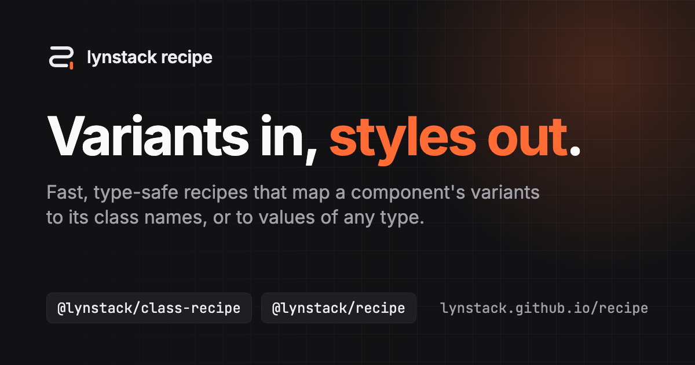

<div align="center">

[](https://lynstack.github.io/recipe/)

[](https://github.com/lynstack/recipe/actions/workflows/ci.yml)
[](https://github.com/lynstack/recipe/actions/workflows/docs.yml)
[](LICENSE)

**[Documentation](https://lynstack.github.io/recipe/)** ·
[class-recipe](https://lynstack.github.io/recipe/class-recipe/) ·
[native-recipe](https://lynstack.github.io/recipe/native-recipe/) ·
[recipe](https://lynstack.github.io/recipe/recipe/)

</div>

# lynstack recipe

Fast, type-safe recipes: functions that map a component's variants to its
styles. Describe the variants once, and a recipe returns the class names,
the React Native style, or any other value for each selection, with every
variant and option checked by TypeScript.

## Packages

| Package                                             | Version                                                                                                               | Size                                                                                                                                           | What it makes                                                                       |
| --------------------------------------------------- | --------------------------------------------------------------------------------------------------------------------- | ---------------------------------------------------------------------------------------------------------------------------------------------- | ----------------------------------------------------------------------------------- |
| [`@lynstack/class-recipe`](packages/class-recipe)   | [](https://www.npmjs.com/package/@lynstack/class-recipe)   | [](https://bundlephobia.com/package/@lynstack/class-recipe)   | Class names, with `cva`, `sva`, and `cx`, a drop-in replacement for `clsx`.         |
| [`@lynstack/native-recipe`](packages/native-recipe) | [](https://www.npmjs.com/package/@lynstack/native-recipe) | [](https://bundlephobia.com/package/@lynstack/native-recipe) | React Native styles, frozen so that the `style` prop keeps its identity.            |
| [`@lynstack/recipe`](packages/recipe)               | [](https://www.npmjs.com/package/@lynstack/recipe)               | [](https://bundlephobia.com/package/@lynstack/recipe)               | Values of any type: the engine that the other two are built on, with no dependency. |

## Example

```sh
npm install @lynstack/class-recipe
```

```ts
import { cva } from "@lynstack/class-recipe";

const button = cva({
  base: "inline-flex items-center rounded-md font-medium",
  variants: {
    tone: {
      neutral: "bg-gray-100 text-gray-900",
      danger: "bg-red-600 text-white",
    },
    size: {
      sm: "h-8 px-3 text-sm",
      md: "h-10 px-4",
    },
  },
  defaultVariants: { size: "md" },
});

button({ tone: "danger" });
// => "inline-flex items-center rounded-md font-medium bg-red-600 text-white h-10 px-4"
```

The [Quick start](https://lynstack.github.io/recipe/class-recipe/quick-start/)
styles a component step by step, and each package's README shows its own
example. To try a package in the browser, open the Playground link on the
overview page of its docs.

## Why recipe

- **Fast.** A recipe compiles its config once and caches the result of
  each selection, so a repeated call is a lookup. See the
  [benchmarks](https://lynstack.github.io/recipe/class-recipe/performance/)
  against `class-variance-authority`, `tailwind-variants`, and `clsx`.
- **Type-safe.** Variants, options, and slots are inferred from the config.
  An unknown option is a type error, and a variant without a default is
  required.
- **Your join.** `class-recipe` joins classes with `twMerge`, or any
  function of your own, once per selection rather than on every call.
- **One engine.** Every package shares the variants, the cache, and the
  types of `@lynstack/recipe`, so a recipe behaves the same whatever it
  returns.
- **Small.** ES modules only. The engine has no dependencies, and the
  other packages depend only on the engine.

## Agent skills

`@lynstack/class-recipe` and `@lynstack/native-recipe` ship agent skills
that teach coding agents to use them well: to write recipes whose classes
never conflict, and to keep React Native styles stable and build them from
theme tokens. Install one with the [skills](https://skills.sh) CLI:

```sh
npx skills add lynstack/recipe --skill class-recipe
npx skills add lynstack/recipe --skill native-recipe
```

## Repository

| Folder                                             | Contents                                                       |
| -------------------------------------------------- | -------------------------------------------------------------- |
| [`packages/recipe`](packages/recipe)               | `@lynstack/recipe`, the engine.                                |
| [`packages/class-recipe`](packages/class-recipe)   | `@lynstack/class-recipe`, built on the engine.                 |
| [`packages/native-recipe`](packages/native-recipe) | `@lynstack/native-recipe`, built on the engine.                |
| [`docs`](docs)                                     | The documentation site, built with Astro and Starlight.        |
| [`examples`](examples)                             | An example app of each package, which the docs open to try it. |
| [`scripts`](scripts)                               | Maintainer scripts, such as the one that measures benchmarks.  |

## Development

The repository is a pnpm workspace. It uses Node.js 24 LTS and the pnpm
version that `package.json` names.

```sh
pnpm install
pnpm check     # build, typecheck, lint, check formatting, and test everything
pnpm test      # run the tests of every package
pnpm bench     # build the packages and run their benchmarks
pnpm measure   # run the benchmarks and save the results that the docs report
pnpm docs:dev  # serve the docs locally
```

Run a package's own scripts with `pnpm --filter`, such as
`pnpm --filter @lynstack/recipe check`. Run `pnpm check` before every
commit.

## Contributing

Read [AGENTS.md](AGENTS.md) before contributing. It describes the layout of the repository, its rules (the public API is a
contract, every change keeps the benchmarks passing, and the docs, READMEs,
TSDoc, and skills agree), and how each package is released. Commits follow
[Conventional Commits](https://www.conventionalcommits.org/).

## License

[MIT](LICENSE) © Tim Phan
